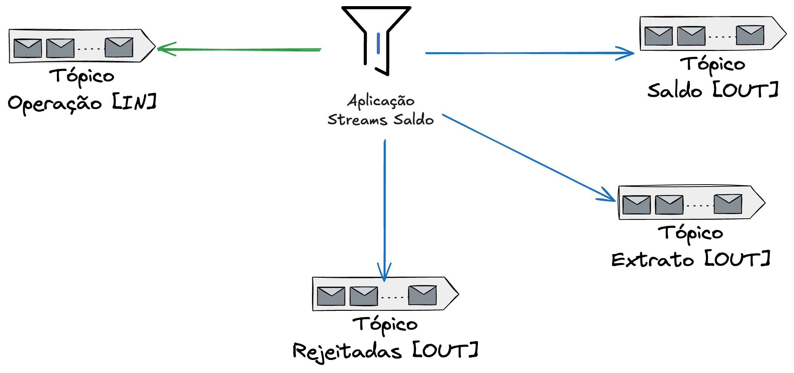

# Aplicação Streams Saldo
Aplicação de exemplo que usa Kafka Streams para gerenciar o saldo de clientes em um banco fictício. Segue diagrama do projeto abaixo:

Precisa de mais informações sobre o projeto ? Acesso o post completo: [[Parte 1] Kafka Streams - Introdução e Caso de Uso]()

### Pré-Requisitos

O que você precisa para rodar este projeto ?

- Docker e Docker Compose
- Java 17
- Maven 3.9.9
- GNU Make

### Como usar ?

Usamos `Make` para realizar todas as operações no projeto. Se você digitar `make` na raiz do projeto verá uma lista de comandos disponíveis, mas segue abaixo os que você vai utilizar:

- `iniciar`: Inicia todos os componentes, incluindo a aplicação de streaming usando Docker Compose.
- `parar`: Para todos os componentes.
- `gerar-operacao-debito`: Cria uma operação de débito no tópico de entrada.
- `gerar-operacao-credito`: Cria uma operação de crédito no tópico de entrada.
- `ver-msg-rejeitadas`: Lista todas as operações rejeitadas.
- `ver-saldo-cliente`: Mostra o saldo de um cliente.
- `ver-extrato-cliente`: Mostra o extrato de um cliente.
- `limpar-dados`: Limpa todos os dados e reinicia os serviços.
